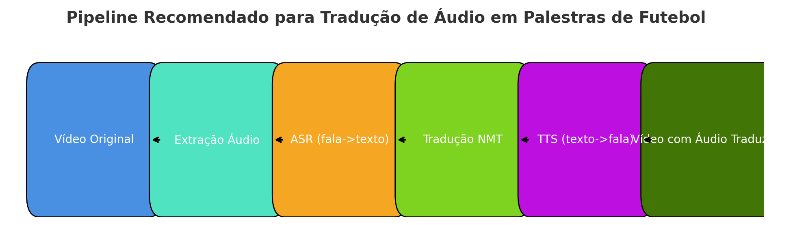

# Projeto para traduzir o audio do video de portuguese em ingles

# Resume
O projeto utiliza 4 passos para a entrega do video traduzido:
1. Extração de audio do video
2. Transcrição do audio em texto (ASR-Automatic Speech Recognition)
3. Tradução do texto em portuguese (NMT-Neural Machine Translation)
4. Conversão de texto para fala (TTS-Text To Speech)
5. Juntar o novo audio com as imagen do video

 

 

# Ferramentas utilizadas
- **FFmpeg:** Multimedia framework para extração e combinação de audio com as imagens do video.
- **Whisper:** Framework open-source para transcrever texto a partir de um audio.
- **DeepL:** SaaS com subscrição para traduzir o texto. No site: *https://developers.deepl.com/docs/getting-started/intro*
- **Azure Neural TTS:** SaaS com subscrição para converter o texto em fala. No Site: *https://learn.microsoft.com/en-us/javascript/api/microsoft-cognitiveservices-speech-sdk/?view=azure-node-latest*